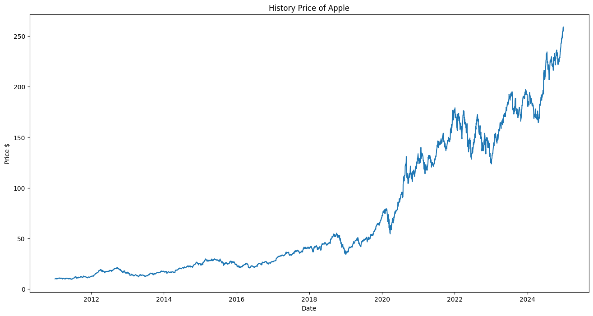

# Stock-Predictor

## Overview
Predicting stock prices is a classic problem in finance and a perfect challenge for data science techniques. With the rise of machine learning, leveraging historical stock price data to predict future trends has become an increasingly valuable tool. 

This project explores how machine learning and deep learning models can analyze historical stock data to forecast future prices. It also evaluates the performance of various models, including regression models and Long Short-Term Memory (LSTM) networks, to provide actionable insights. A Streamlit-based web application has been developed to allow users to interact with the models, visualize trends, and receive predictions.


---

## Table of Contents
1. [Installation](#installation)
2. [Project Purpose](#project-purpose)
3. [Project Details](#project-details)
4. [File Descriptions](#file-descriptions)
5. [How to Run](#how-to-run)
6. [Analysis Overview](#analysis-overview)
7. [Results](#results)
8. [Conclusion](#conclusion)
9. [Limitations and Future Work](#limitations-and-future-work)
9. [Acknowledgements](#acknowledgements)

---

## Installation

To set up and run the project, ensure the following Python libraries are installed:
- `streamlit`
- `yfinance`
- `pandas`
- `numpy`
- `matplotlib`
- `tensorflow`
- `scikit-learn`
- `keras`
- `scikeras`


### Steps:
1. **Set Up Virtual Environment** (Optional but recommended):
   ```bash
   python -m venv env
   source env/bin/activate   # On Windows: .\env\Scripts\activate
   ```
2. **Install Dependencies**:
   ```bash
   pip install -r requirements.txt
   ```

---

## Project Purpose

Predicting stock prices has long been a challenge in quantitative finance. The ability to anticipate market trends and price movements can provide a significant edge to investors and traders. This project addresses key questions:

- How can machine learning models utilize historical data to predict future stock prices?
- Which machine learning models are most effective for financial forecasting?
- How can we build an intuitive application that democratizes the power of machine learning in stock prediction?

This project combines financial data analysis with predictive modeling to answer these questions, leveraging multiple machine learning approaches for comparative insights.


---

## Project Details

Problem Statement
Stock price movements are inherently complex and influenced by multiple factors. Despite this complexity, historical stock price data provides patterns and trends that can be leveraged for prediction.

The primary question this project aims to address is:

How effectively can machine learning models predict stock prices based on historical data?
Which models are most suitable for this task in terms of accuracy, interpretability, and computational efficiency?
This project aims to create a robust solution for predicting stock prices and compare model performances using standard evaluation metrics.

The Stock-Predictor aims to:
1. **Predict Stock Prices**: Develop models to forecast future stock prices based on historical data.
2. **Compare Model Performance**: Evaluate and contrast various models, including:
   - Linear Regression
   - Decision Tree Regression
   - Support Vector Machine (SVM)
   - Long Short-Term Memory (LSTM) Neural Networks
3. **User-Centric Application**: Build a Streamlit-based web app that offers:
   - Interactive visualization of stock trends.
   - Predictions based on user-selected models and stock tickers.

### Metrics:
- **Mean Squared Error (MSE)**: Measures the average squared difference between predicted and actual values. Lower MSE indicates better performance.
- **R² Score**: Indicates the proportion of variance explained by the model. A higher R² score represents a better fit.
- **Prediction Accuracy**: Evaluates the percentage of predictions that fall within a 5-10% range of actual prices, offering a practical measure of prediction reliability.

---

## File Descriptions

- **`Stock_predictor.ipynb`**: Main notebook for data analysis, model training, evaluation, and results.
- **`User_Interface.ipynb`**: Interactive notebook for testing predictions and fine-tuning parameters.
- **`helper.py`**: Helper functions for data extraction and preprocessing.
- **`regression_model.py`**: Machine learning models for stock price prediction.
- **`stock_app.py`**: Streamlit-based web application for real-time predictions.
- **`requirements.txt`**: Required Python libraries for the project.

---

## How to Run

1. **Install Dependencies**:
   ```bash
   pip install -r requirements.txt
   ```
2. **Run the Web Application**:
   ```bash
   streamlit run stock_app.py
   ```
3. **Select Options**:
   - Choose stock tickers and prediction models from the left sidebar.
   - View historical trends and next-day price predictions.

---

## Analysis Overview

### Data Description
- **Provider**: Yahoo Finance API.
- **Details**: Historical stock data, including open, close, high, low prices, volume, dividends, and stock splits.

### Methodology
1. **Regression Models**:
   - Linear Regression: A simple baseline model that assumes linear relationships between features and the target variable.
   - Decision Tree Regression: Captures non-linear relationships but risks overfitting without proper tuning.
   - Support Vector Machine (SVM): Handles non-linear patterns using kernel functions like polynomial and radial basis function (RBF).
2. **Deep Learning**:
   - LSTM Neural Networks to model long-term dependencies: Captures long-term dependencies in time series data, suitable for complex stock price movements.

### Preprocessing
Normalization:
For models like LSTM, stock prices are normalized to a range of (0, 1) using MinMaxScaler to ensure stable model training.
Train-Test Split:
Data is split into 80% training and 20% testing to evaluate model performance on unseen data.
Feature Engineering:
For LSTM, the previous 60 days' closing prices are used as input to predict the next day’s price.

### Evaluation
- Train models on historical data and compare predictions against actual stock prices using metrics like MSE and R² Score.

---

## Results

| Model        | Train MSE | Test MSE | Train R² | Test R² | Prediction Accuracy (%) |
|--------------|-----------|----------|----------|---------|-------------------------|
| Linear       | 7.42      | 3.27     | 0.92     | 0.94    | 98.5                   |
| DecisionTree | 5.61      | 9.36     | 0.94     | 0.83    | 96.8                   |
| SVM          | 9.16      | 3.88     | 0.91     | 0.93    | 97.3                   |
| LSTM         | 1.40      | 25.56    | 0.99     | 0.83    | 92.7                   |

Key Findings:
- Linear Regression provides robust predictions for short-term trends.
- Decision Tree Regression risks overfitting with high depth.
- SVM balances complexity and generalization.
- LSTM captures intricate patterns but may overfit small datasets.

Visualization:
The closing price history of Apple Inc. is shown below. 


---

## Conclusion

### Reflection
This project demonstrates the feasibility of predicting stock prices using machine learning models. While simpler models like Linear Regression perform well for short-term forecasting, advanced models like LSTM capture more complex dependencies.

- **Strengths**:
  - Linear Regression and SVM offer reliable predictions with minimal tuning.
  - LSTM models excel in identifying long-term trends.
- **Challenges**:
  - Overfitting in Decision Trees and LSTM models requires careful parameter optimization.
  - Additional features (e.g., financial ratios, sector trends) could enhance predictive accuracy.

### Future Directions
1. **Feature Engineering**:
   - Incorporate moving averages, volatility metrics, and financial indicators.
2. **Alternative Models**:
   - Explore Random Forests, Gradient Boosting, or Attention-based deep learning architectures.
3. **Robustness Testing**:
   - Evaluate models across volatile market conditions.

---
## Limitations and Future Work

### Limitations
While the Stock-Predictor project achieves its goals of providing accurate stock price predictions and an interactive user interface, there are several limitations to consider:

1. **Data Features**:
   - The models rely primarily on historical closing prices. Other potentially significant features, such as volume, financial ratios, or macroeconomic indicators, are not included.

2. **Overfitting**:
   - Advanced models like LSTM show signs of overfitting on training data, especially with small datasets. This limits their generalization to unseen data.

3. **Volatility and Extreme Events**:
   - The models are less effective for stocks with high volatility or those influenced by sudden events (e.g., earnings announcements, regulatory changes).

4. **Prediction Horizon**:
   - The models are optimized for next-day predictions. Multi-day or long-term forecasts may require more complex modeling approaches.

5. **Computational Efficiency**:
   - The grid search for parameter optimization, particularly for LSTM, is computationally expensive and time-consuming.

### Future Work
To address these limitations and enhance the project, the following improvements are proposed:

1. **Feature Engineering**:
   - Incorporate additional features, such as:
     - Moving averages, volatility, and momentum indicators.
     - Sector-specific trends or macroeconomic factors.
     - Textual sentiment analysis from financial news or social media.

2. **Alternative Models**:
   - Experiment with ensemble methods (e.g., Random Forests, Gradient Boosting) for regression tasks.
   - Explore neural network architectures, such as Attention Mechanisms or Transformers, for better handling of time series data.

3. **Enhanced Preprocessing**:
   - Utilize techniques like Principal Component Analysis (PCA) to reduce noise and highlight critical data trends.
   - Normalize or scale features uniformly across all datasets for better consistency.

4. **Prediction Horizon Expansion**:
   - Extend the application to support predictions over multiple days or weeks, with configurable horizons based on user input.

5. **Real-Time Integration**:
   - Connect the application to real-time data sources for live updates and predictions.
   - Incorporate user feedback mechanisms for iterative model improvement.

By implementing these enhancements, the Stock-Predictor can evolve into a more robust and versatile tool for financial forecasting.


---


## Acknowledgements

- **Data Source**: [Yahoo Finance API](https://finance.yahoo.com/).
- **Project Framework**: Developed during the Udacity Data Science Nanodegree.

---
